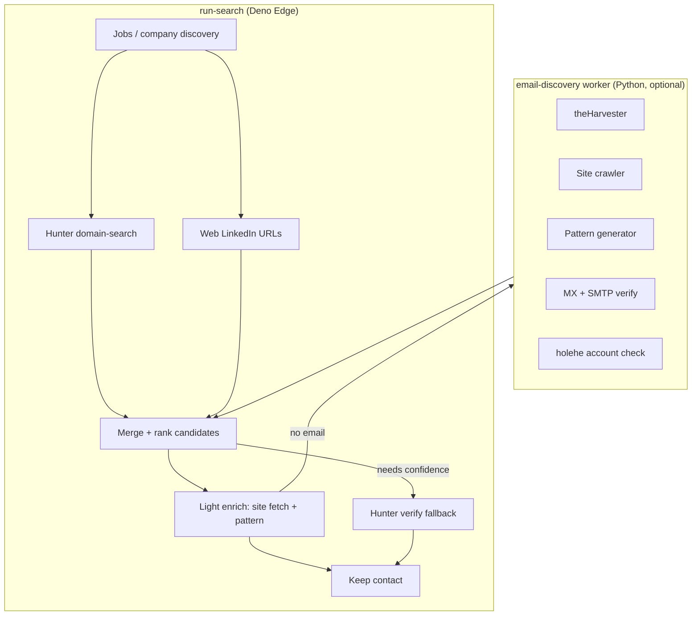

# In-house email discovery (OSINT stack)

FollowUp today discovers **people** via Hunter domain search, Serper/Bing LinkedIn URLs, and optional Proxycurl, then uses Hunter **email-finder** and **email-verifier** for contacts without an email. Hunter’s free tier is **~50 API calls/month** plus **10 emails per domain** on domain-search — fine to keep, but per-contact find/verify burns quota fast.

This design adds **pluggable in-house providers** (public sources only), compares them in a local harness, and optionally attaches a small **Python worker** that `run-search` calls when configured.

## Goals

| Goal | Approach |
|------|----------|
| Keep Hunter for high-signal domain dumps | Still call `domain-search` (limit 10) when `HUNTER_API_KEY` is set |
| Stop burning Hunter on every websearch contact | Replace `email-finder` / primary `email-verifier` with in-house pipeline |
| Try multiple tools, measure hit rate | Local `tools/email-discovery` CLI + CSV eval |
| Fit Supabase Edge constraints | Heavy OSINT runs **outside** Deno (worker); light steps inline in Edge |
| Ethical / ToS | Public pages, search APIs, MX/SMTP checks only — **no LinkedIn scraping** (unchanged) |

## Architecture



### Why a worker

| Tool | Runs in Edge? | Notes |
|------|----------------|-------|
| DNS / MX lookup | Yes (DoH or `dns` lookup) | Fast, no subprocess |
| Fetch company `/contact`, `/about` | Yes | Same as mini-Photon |
| Email pattern generation | Yes | Pure logic |
| theHarvester, Photon, holehe, Maigret, SpiderFoot | **No** | Subprocess, long runtime, extra deps |
| SMTP RCPT probe | Risky in Edge | IP reputation, timeouts → worker or skip |

**Contract:** worker exposes `POST /v1/enrich` (single company batch) and returns the same shape as internal `Candidate` fragments (see below).

Env (Edge): `OSINT_WORKER_URL`, `OSINT_WORKER_SECRET` (shared bearer).

## Provider model

Align with existing `Candidate` in `run-search`:

```ts
type Candidate = {
  first_name, last_name, full_name, title, email, linkedin_url,
  verification_status,  // map to Hunter-like: valid | accept_all | risky | unknown
  sources: string[],
  source_details: Record<string, unknown>,
}
```

### Source IDs (add to `sources` / UI pills)

| `sources[]` | Role | Phase |
|-------------|------|-------|
| `hunter` | Domain search (+ optional verify fallback) | Shipped |
| `websearch` | LinkedIn URL discovery | Shipped |
| `site_crawl` | Emails from employer site (Edge or worker) | **P0** |
| `harvester` | theHarvester emails/names for domain | **P1** |
| `pattern` | Guessed from inferred format | **P0** |
| `verify_mx` | Syntax + MX only | **P0** |
| `verify_smtp` | SMTP RCPT (worker) | **P1** |
| `holehe` | Confirms email used on public sites (not discovery) | **P2** |
| `maigret` | Username → profiles (enrichment, not email) | **P3** |

`discovery_source` on insert remains `sources[0]` or first source that supplied **email**.

### Provider interface (Python + mirrored TS)

Each provider implements:

- `discover_domain(domain) → list[EmailHit]` — emails + optional name/title from public data
- `discover_person(domain, first, last) → list[EmailCandidate]` — ranked guesses with `confidence` 0–1
- `verify(email) → VerificationResult` — `status`, `detail`

Orchestrator runs providers in **priority order**, merges by email, keeps best verification + union of `sources`.

## Pipeline (per company, after merge of Hunter + web)

1. **Collect seed emails** — Hunter domain-search + `site_crawl` + `harvester` (worker).
2. **Infer pattern** — From seeds, detect `{first}.{last}`, `{f}{last}`, `{first}`, etc. (see `tools/email-discovery/patterns.py`).
3. **For each ranked person without email** — Generate top N patterns → `verify_mx` → optional `verify_smtp` (worker).
4. **Confidence gate** — Keep if `verify_smtp` valid, or MX+pattern match with ≥2 seed emails same pattern, or Hunter verify when `HUNTER_VERIFY_FALLBACK=true`.
5. **Optional holehe** — If email kept but SMTP inconclusive, holehe “exists on site X” boosts confidence (never sole signal).

### Hunter quota policy

| Setting | Behavior |
|---------|----------|
| Default (`HUNTER_CONSERVE=true`) | Domain-search only; **no** `email-finder`; verify in-house first |
| `HUNTER_VERIFY_FALLBACK=true` | Call Hunter verifier only when in-house `unknown` / `risky` |
| `HUNTER_CONSERVE=false` | Legacy: finder + verifier on every contact |

Track in `source_stats`: `hunter.calls.domain_search`, `hunter.calls.email_finder`, `hunter.calls.verifier`.

## Phased rollout

### P0 — Edge-only (no new infra)

Implement in `supabase/functions/_shared/email_discovery.ts`:

- `crawlPublicSiteEmails(domain)` — GET `/`, `/contact`, `/about`, `/team`; extract `mailto:` + regex; respect size/time limits.
- `inferEmailPattern(seeds, domain)` — pattern voting.
- `guessEmail(first, last, pattern)` — generate candidates.
- `verifyEmailLight(email)` — syntax (`email-validator` logic or regex) + MX via DNS-over-HTTPS (Google/Cloudflare).

Wire into `run-search` **after** merge, **before** Hunter finder block; only call Hunter when P0 failed and conserve mode off.

### P1 — Local worker + CLI eval

`tools/email-discovery/` (this repo):

- Subprocess **theHarvester** (`-d domain -b bing,google,github -l 50`).
- **Site crawler** (requests + BeautifulSoup; Photon-like, fewer deps).
- **SMTP verify** (optional, configurable timeout).
- FastAPI `POST /v1/enrich` for Edge integration.

Run-search: if `OSINT_WORKER_URL` set, `await fetch(worker, { domain, people: [{first, last}] })` in parallel with Hunter domain-search (worker timeout 45s per company).

### P2 — holehe + GitHub seeds

- holehe on final candidate only (slow).
- theHarvester `-b github` for commit emails on `@{domain}` org repos.

### P3 — Deep mode only (off by default)

- Maigret/Sherlock from LinkedIn slug (profile URL only — no login).
- Subfinder/Amass for subdomain → more crawl targets.
- SpiderFoot CE in Docker — manual/ops, not in user search path.

## Evaluation harness

Compare providers without shipping to prod:

```bash
cd tools/email-discovery
python -m venv .venv && source .venv/bin/activate
pip install -r requirements.txt
python -m email_discovery eval --csv fixtures/eval_set.csv --providers site_crawl,harvester,pattern_smtp
```

CSV columns: `domain`, `first_name`, `last_name`, `expected_email` (optional), `notes`.

Report per provider:

- **hit rate** — expected_email in candidate set (if labeled)
- **precision proxy** — SMTP `valid` / MX-only
- **latency p50/p95**
- **errors** — rate limits, blocks

Store results in `tools/email-discovery/reports/` (gitignored).

## UI / API surfacing

- Overview **SourceCard** for `osint` or split `site_crawl` / `harvester` / `pattern`.
- `by_provider` on company report: add `osint`, `pattern`.
- Filters: “Require verified email” maps to in-house + Hunter statuses (`valid`, `accept_all`).

## Security & ops

- Worker: auth header, no public internet unless deployed behind VPN or signed JWT from Edge.
- Rate-limit worker per user/run; cap pages crawled per domain (e.g. 15 URLs, 2MB each).
- Log domains processed, not full page bodies.
- SMTP probing: use only when user opts in (`accept_smtp_probe` filter) — some mail servers tarpit.

## Success criteria (before relying on in-house)

On a labeled eval set of **≥30** hiring-manager targets across mixed company sizes:

- **≥40%** of contacts get a **SMTP-valid or Hunter-valid** email without `email-finder`.
- **False positive rate** &lt;10% (manual spot-check on 20 guesses).
- P95 added latency **&lt;60s** per company with worker; **&lt;8s** Edge-only P0.

## Related files

| Area | Path |
|------|------|
| Current Hunter integration | `supabase/functions/run-search/index.ts` |
| Hunter HTTP helper | `supabase/functions/_shared/cors.ts` |
| Local PoC / providers | `tools/email-discovery/` |
| Project log | `PROJECT_LOG.md` |
